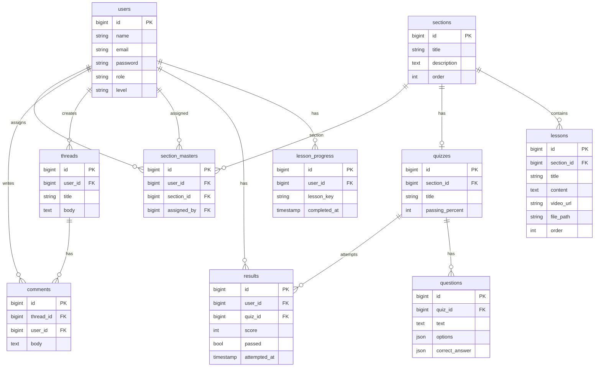

# Архитектура платформы SmartLMS  
## Интерактивная среда проектного обучения (Информатика)

Документ описывает полную, масштабируемую и готовую к продакшену архитектуру платформы **SmartLMS** (Smart Learning Management System).

**Назначение проекта:** платформа для школьного курса **информатики**. Ученики проходят вступительный тест, получают уровень (новичок / продвинутый), изучают разделы с уроками и видео, проходят квизы и открывают следующие темы. Учителя и администраторы добавляют уроки, квизы и материалы, следят за прогрессом школьников. Интерфейс и тексты ориентированы на дружелюбное восприятие школьниками.

---


## 1. Обзор системы

### 1.1 Назначение и роли

Платформа строится вокруг трёх ролей: **Студент**, **Преподаватель**, **Администратор**. Ниже — цель каждой роли, технические возможности и преимущества.

#### 1.2.1 Студент (Student)

**Главная цель:** получение знаний и достижение личного прогресса.

**Технические возможности:**
- Доступ к витрине доступных курсов и уроков (разделы по уровню).
- Прохождение адаптивных тестов (вступительный тест и квизы разделов; результаты влияют на уровень и доступ к материалам).
- Личный кабинет со статистикой успеваемости и «бейджами» за достижения (XP, достижения, «Мастер раздела»).
- Возможность оставлять вопросы и обсуждения (форум, комментарии к темам; под уроками — через форум по темам курса).

**Преимущества:**
- **Персонализация:** система подстраивается под уровень (Beginner/Intermediate/Advanced; в текущей реализации используются уровни beginner и advanced), не перегружая сложной теорией.
- **Геймификация:** визуальный прогресс (XP, уровни, бейджи) мотивирует учиться дальше.

---

#### 1.2.2 Преподаватель (Teacher / Mentor)

**Главная цель:** контроль качества обучения и создание контента.

**Технические возможности:**
- Конструктор уроков: добавление текста, видео, файлов (PDF/Doc); порядок уроков.
- Управление базой вопросов для тестов (редактирование квиза раздела: вопросы, варианты, правильный ответ, порог прохождения).
- Просмотр детальной аналитики по каждому студенту (кто «застрял», кто молодец): прогресс учеников, прохождение квизов, назначение «Мастер раздела».
- Обратная связь и поощрение: назначение бейджа «Мастер раздела» за успешное прохождение.

**Преимущества:**
- **Автоматизация:** тесты проверяются системой автоматически.
- **Аналитика:** видно, кто прошёл квизы, кто нет; можно масштабировать обратную связь через бейджи и прогресс.

---

#### 1.2.3 Администратор (Admin)

**Главная цель:** техническая поддержка и управление платформой.

**Технические возможности:**
- Полный CRUD пользователей: просмотр списка, смена ролей (Студент / Учитель / Администратор).
- Настройка доступа: назначение ролей определяет доступ к разделам, кабинету учителя и админ-панели.
- (Планируется: глобальные параметры — категории, уровни доступа; подписки и платные курсы; системные логи и отчёты об ошибках.)

**Преимущества:**
- **Безопасность:** контроль над тем, кто имеет доступ к данным и админ-функциям.
- **Масштабируемость:** возможность быстро добавлять новых учителей и управлять потоками студентов через смену ролей.

---

### 1.3 Идея проекта (логика для ученика и учителя)

**Ученик:** регистрируется на сайте → проходит вступительный тест → в зависимости от результата попадает в один из двух уровней: **новичок** (beginner) или **продвинутый** (advanced). При входе в систему ученикам в зависимости от уровня открываются **разные разделы** с обучающим материалом (разделы могут быть помечены уровнем или общие). В конце каждого раздела ученик должен **пройти викторину**, чтобы разблокировать и перейти в следующий раздел. Уроки внутри раздела доступны по порядку; можно отмечать урок как пройденный (+XP).

**Учитель:** загружает материал (разделы, уроки с текстом, видео, файлами), настраивает викторины (вопросы, проходной балл), назначает достижения ученикам и «Мастер раздела», ведёт обратную связь. Форум используется для **обсуждения проектов** — темы можно привязывать к разделам; учитель модерирует (скрытие тем/комментариев).

### 1.4 Ключевые сценарии

1. Регистрация → автоматически `role=student`, `level=none` → редирект на вступительный тест.
2. Вступительный тест: порог в `config/smartlms.php` (`placement_threshold_percent`, по умолчанию 60%): &lt; порога → `beginner`, ≥ порога → `advanced`.
3. Студент видит разделы для своего уровня; следующий раздел открывается только после успешного прохождения квиза предыдущего.
4. В разделе: уроки (текст, видео, файлы) + квиз в конце.
5. Учитель управляет разделами, уроками, квизами, назначает мастеров раздела и достижения; форум — для обсуждения проектов с привязкой к разделам.

### 1.5 Стек технологий

| Слой | Технология |
|------|------------|
| Backend | PHP 8.x, Laravel 11 |
| Frontend | Blade, TailwindCSS, Vite, Alpine.js (Breeze) |
| БД | MySQL / PostgreSQL (миграции Laravel) |
| Кэш (рекомендация) | Redis — сессии, лидерборды, кэш разблокировок |
| Файлы/видео | Laravel Storage (local/S3), публичный диск для раздачи файлов |
| Аутентификация | Laravel Breeze (session-based), при необходимости — Sanctum для API/JWT |

### 1.6 Страницы и навигация (что и где открывается)

| URL | Кто открывает | Описание |
|-----|----------------|----------|
| `/` | Все | Главная (welcome) — лендинг, кнопки «Кабинет», «Кіру», «Тіркелу». |
| `/login` | Гости | Вход в аккаунт. После входа редирект на `/placement-test` или `/dashboard`. |
| `/register` | Гости | Регистрация. После регистрации редирект на вступительный тест. |
| `/locale/{locale}` (kk или ru) | Все | Переключение языка (казахский/русский). Редирект обратно. |
| `/placement-test` | Авторизованные без уровня | Вступительный тест. GET — форма, POST — отправка. После прохождения редирект на `/dashboard`. |
| `/dashboard` | Студент (после placement) | Личный кабинет: уровень, XP, достижения, блоки разделов, кнопка «Барлық бөлімдер» → разделы. |
| `/sections` | Студент | Список разделов курса. Ссылка на каждый раздел → `/sections/{id}`. |
| `/sections/{id}` | Студент | Страница раздела: уроки и кнопка перехода к квизу раздела. |
| `/sections/{section}/lessons/{lesson}` | Студент | Страница урока (текст, видео, файл для скачивания). |
| `/sections/{section}/quiz` | Студент | Квиз раздела. POST — отправка ответов; при успехе открывается следующий раздел. |
| `/forum` | Студент | Список тем форума. Кнопка «Жаңа тақырып» → `/forum/create`. |
| `/forum/create` | Студент | Создание новой темы. POST → сохранение, редирект на тему. |
| `/forum/{thread}` | Студент | Тема с комментариями и вложенными ответами. |
| `/teacher/dashboard` | Учитель | Кабинет учителя: ссылки на разделы и прогресс учеников. |
| `/teacher/sections` | Учитель | Список разделов для редактирования. Создание/редактирование/удаление разделов. |
| `/teacher/sections/{id}` | Учитель | Раздел: уроки, кнопки «Сабақ қосу», «Бөлім квизі», редактирование уроков. |
| `/teacher/sections/{section}/lessons/create` | Учитель | Создание урока. |
| `/teacher/lessons/{id}/edit` | Учитель | Редактирование урока. |
| `/teacher/sections/{section}/quiz` | Учитель | Редактирование квиза раздела. |
| `/teacher/progress` | Учитель | Прогресс учеников, назначение «Мастер раздела». |
| `/admin` | Админ | Панель администратора: сводка, ссылка на управление пользователями. |
| `/admin/users` | Админ | Список пользователей, смена ролей. |
| `/profile` | Авторизованные | Редактирование профиля (Breeze). |

**Как открываются страницы:** переход по ссылкам в шапке (Кабинет, Бөлімдер, Форум, переключатель языка/темы/режима для слабовидящих), по кнопкам на дашборде и в разделах, по прямому URL. После логина студент без уровня попадает на вступительный тест, затем — в кабинет.

### 1.6 Роли и доступ (технические детали)

| Роль | Значение в БД | Кто назначает | Доступ |
|------|----------------|---------------|--------|
| **Студент** | `student` | По умолчанию при регистрации | Личный кабинет, разделы по уровню, квизы, форум. Обязателен вступительный тест (placement), затем доступ по уровню (beginner/advanced). |
| **Учитель** | `teacher` | Только администратор (Админ → Пользователи → смена роли) | Всё то же, что студент, плюс: кабинет учителя (`/teacher/dashboard`), разделы и уроки (CRUD), квизы разделов, прогресс учеников, назначение «Мастер раздела». |
| **Администратор** | `admin` | Только вручную (админ меняет роль в админке или через БД/сидер) | Всё то же, что учитель, плюс: панель администратора (`/admin`), управление пользователями, смена ролей (student/teacher/admin). |

- **Регистрация:** всегда создаётся пользователь с ролью `student` и `level=none`; редирект на вступительный тест.
- **Вступительный тест:** обязателен только для студентов. Пользователи с ролью `teacher` или `admin` не редиректятся на placement и могут заходить в кабинет без прохождения теста.
- **Middleware:** маршруты `/teacher/*` защищены `auth` + `teacher` (EnsureTeacher); маршруты `/admin/*` — `auth` + `admin` (EnsureAdmin). При отсутствии роли возвращается 403 с сообщением из переводов (`messages.forbidden_teacher` / `messages.forbidden_admin`).
- **Константы ролей:** в коде используются `User::ROLE_STUDENT`, `User::ROLE_TEACHER`, `User::ROLE_ADMIN` и `User::roles()` (список для валидации и выбора в админке).
- **Первый администратор:** выполнить `php artisan db:seed` (создаётся admin@example.com) или назначить роль существующему пользователю: `php artisan smartlms:make-admin user@example.com`.

---

## 2. Схема базы данных и ER-диаграмма

### 2.1 Таблицы

- **users** — пользователи: `id`, `name`, `email`, `email_verified_at`, `password`, `remember_token`, `role` (student|teacher|admin), `level` (none|beginner|advanced), `xp`, `timestamps`.
- **password_reset_tokens** — сброс пароля (email, token, created_at).
- **sessions** — сессии (id, user_id, ip_address, user_agent, payload, last_activity).
- **sections** — разделы курса: `id`, `title`, `description`, `order`, `timestamps`.
- **lessons** — уроки: `id`, `section_id`, `title`, `content`, `is_advanced`, `video_url`, `file_path`, `order`, `timestamps`.
- **quizzes** — квизы: `id`, `section_id`, `title`, `passing_percent`, `timestamps`.
- **questions** — вопросы квиза: `id`, `quiz_id`, `text`, `type` (single|multiple), `options` (JSON), `correct_answer` (JSON), `order`, `timestamps`.
- **results** — попытки квизов: `id`, `user_id`, `quiz_id`, `score`, `passed`, `attempted_at`, `timestamps`; индекс (user_id, quiz_id).
- **lesson_progress** — прогресс по урокам: `id`, `user_id`, `lesson_key`, `completed_at`, уникальность (user_id, lesson_key).
- **threads** — темы форума: `id`, `user_id`, `title`, `body`, `timestamps`.
- **comments** — комментарии к темам: `id`, `thread_id`, `user_id`, `body`, `timestamps`.
- **section_masters** — мастера раздела: `id`, `user_id`, `section_id`, `assigned_by`, `timestamps`; уникальность (user_id, section_id).

### 2.2 ER-диаграмма (Mermaid)



---

## 3. Структура проекта (Laravel)

```
SmartMS/
├── app/
│   ├── Http/
│   │   ├── Controllers/
│   │   │   ├── Auth/           # Регистрация, логин, сброс пароля, верификация email
│   │   │   ├── Teacher/       # TeacherDashboard, Section, Lesson, Quiz, StudentProgress
│   │   │   ├── PlacementTestController.php
│   │   │   ├── SectionController.php
│   │   │   ├── LessonController.php
│   │   │   ├── QuizController.php
│   │   │   ├── ForumController.php
│   │   │   └── ProfileController.php
│   │   ├── Middleware/
│   │   │   ├── EnsurePlacementCompleted.php
│   │   │   └── EnsureTeacher.php
│   │   └── Requests/
│   ├── Models/
│   │   ├── User.php
│   │   ├── Section.php, Lesson.php, Quiz.php, Question.php, Result.php
│   │   ├── LessonProgress.php, SectionMaster.php
│   │   ├── Thread.php, Comment.php
│   └── View/Components/
│       ├── AppLayout.php
│       └── GuestLayout.php
├── bootstrap/app.php          # Роуты, middleware (ensure.placement.completed, teacher)
├── config/
│   ├── auth.php, filesystems.php
│   └── ...
├── database/
│   ├── migrations/
│   └── seeders/
├── docs/
│   └── ARCHITECTURE.md
├── public/
│   └── images/logo.png
├── resources/
│   ├── views/
│   │   ├── layouts/app.blade.php
│   │   ├── auth/
│   │   ├── dashboard.blade.php, placement-test.blade.php
│   │   ├── sections/, lessons/, quiz/
│   │   ├── forum/
│   │   └── teacher/
│   ├── css/app.css
│   └── js/app.js
├── routes/
│   ├── web.php
│   └── auth.php
├── storage/
│   └── app/public/            # Загруженные файлы уроков (symlink public/storage)
└── .env
```

---

## 4. Маршруты (API / Endpoints)

### 4.1 Гостевые и общие

| Method | URI | Описание |
|--------|-----|----------|
| GET | `/` | Welcome |
| GET/POST | `/login` | Вход |
| GET/POST | `/register` | Регистрация (→ placement-test) |
| GET | `/forgot-password`, `/reset-password` | Сброс пароля |
| GET | `/email/verify` | Верификация email |

### 4.2 После входа (auth, verified)

| Method | URI | Описание |
|--------|-----|----------|
| GET | `/placement-test` | Вступительный тест (форма) |
| POST | `/placement-test` | Отправка ответов, установка level |

### 4.3 Студент (auth, verified, ensure.placement.completed)

| Method | URI | Описание |
|--------|-----|----------|
| GET | `/dashboard` | Кабинет: разделы + разблокировки |
| GET | `/sections` | Список разделов |
| GET | `/sections/{section}` | Раздел + уроки |
| GET | `/sections/{section}/lessons/{lesson}` | Просмотр урока (текст, видео, файл) |
| GET | `/sections/{section}/quiz` | Страница квиза |
| POST | `/sections/{section}/quiz` | Отправка ответов, запись Result, разблокировка следующего раздела |
| GET | `/forum` | Список тем |
| GET | `/forum/create` | Форма новой темы |
| POST | `/forum` | Создание темы |
| GET | `/forum/{thread}` | Тема + комментарии |
| POST | `/forum/{thread}/comments` | Добавление комментария |

### 4.4 Учитель (auth, teacher)

| Method | URI | Описание |
|--------|-----|----------|
| GET | `/teacher/dashboard` | Кабинет учителя |
| GET/POST | `/teacher/sections` | Список / создание раздела |
| GET/PUT/PATCH/DELETE | `/teacher/sections/{section}` | Просмотр/редактирование/удаление раздела |
| GET/POST | `/teacher/sections/{section}/lessons` | Список / создание урока |
| GET/PUT/PATCH/DELETE | `/teacher/lessons/{lesson}` | Редактирование/удаление урока (shallow) |
| GET | `/teacher/sections/{section}/quiz` | Редактирование квиза |
| PUT | `/teacher/sections/{section}/quiz` | Сохранение квиза и вопросов |
| GET | `/teacher/progress` | Прогресс учеников |
| POST | `/teacher/progress/master` | Назначение мастера раздела |

### 4.5 Профиль

| Method | URI | Описание |
|--------|-----|----------|
| GET | `/profile` | Редактирование профиля |
| PATCH | `/profile` | Обновление |
| DELETE | `/profile` | Удаление аккаунта |

---

## 5. Аутентификация и авторизация

### 5.1 Поток аутентификации

1. **Регистрация** (`RegisteredUserController`): создаётся пользователь с `role=student`, `level=none`; после входа редирект на `/placement-test`.
2. **Вход**: Breeze session (cookie). При необходимости API — Laravel Sanctum (SPA или токены).
3. **Email verification**: Laravel встроенно; маршруты в `auth.php`. Middleware `verified` на защищённых маршрутах.
4. **Сброс пароля**: `password_reset_tokens` + письмо с ссылкой на сброс.

### 5.2 Роли и middleware

- **student** — доступ к разделам/урокам/квизам/форуму после прохождения placement test.
- **teacher** — доступ к `/teacher/*` (middleware `teacher` → `EnsureTeacher`: `auth()->user()->role === 'teacher'`).
- **ensure.placement.completed** — редирект на `/placement-test`, если у студента `level === null` или `level === 'none'`.

### 5.3 Безопасность

- Пароли: `Hash::make()` / `password_verified()` (bcrypt).
- CSRF: все формы с `@csrf`; VerifyCsrfToken middleware.
- XSS: в Blade — `{{ }}`, для HTML контента уроков — `{!! nl2br(e($lesson->content)) !!}`.
- Доступ к разделу/квизу: проверка `unlockedSectionIds()`; при отсутствии доступа — 403.

---

## 6. Логика квизов и разблокировки разделов

### 6.1 Разблокировка (SectionController::unlockedSectionIds)

- Учителя видят все разделы (все id).
- Студент:
  - Первый раздел всегда открыт.
  - Раздел N открыт, если у студента есть запись `Result` по квизу раздела N−1 с `passed = true`.
- Квиз может отсутствовать у раздела — тогда следующий раздел считается открытым без прохождения квиза.

### 6.2 Оценка квиза (QuizController::submit)

- По каждому вопросу: `q_{id}` из запроса сравнивается с `correct_answer` (один или массив для multiple).
- Считается доля правильных ответов → `score` (0–100).
- `passed = (score >= quiz.passing_percent)`.
- Сохраняется новая запись `Result` при каждой попытке (повторные прохождения разрешены).
- При `passed` — редирект на раздел с сообщением об успехе; иначе — обратно на квиз с сообщением о проценте и пороге.

### 6.3 Вступительный тест (PlacementTestController)

- Фиксированный набор вопросов; ответы в `answers[id]`.
- Процент правильных: `percent >= 70` → `level = 'advanced'`, иначе `level = 'beginner'`.
- Обновление `User::level`, редирект на dashboard.

---

## 7. Система достижений (расширение)

Текущая реализация: «Мастер раздела» (section_masters). Полноценная система достижений и XP может быть добавлена так:

- **Таблицы**: `achievements` (id, key, name, description, icon, xp), `user_achievements` (user_id, achievement_id, awarded_at), `users.xp` (int, default 0).
- **Логика**: при прохождении квиза, создании поста на форуме, первом уроке раздела и т.д. — проверка условий и начисление achievement + XP.
- **Кэш**: Redis для лидерборда по XP и топ достижений.

---

## 8. Форум

### 8.1 Структура

- **Темы** (threads): user_id, title, body. Список с пагинацией; сортировка по дате.
- **Комментарии** (comments): thread_id, user_id, body; плоский список (вложенность при необходимости через `parent_id` и рекурсивная загрузка).

### 8.2 Модерация (расширение)

- Поля в `threads`/`comments`: `is_pinned`, `is_locked`, `moderated_at`, `moderated_by`.
- Роль `admin` или права учителя: скрытие/удаление, закрепление, закрытие темы.

### 8.3 Лайки (расширение)

- Таблица `thread_likes` / `comment_likes` (user_id, thread_id или comment_id), подсчёт через count или кэш.

---

## 9. Файлы и видео в уроках

### 9.1 Модель Lesson

- **content** — текст урока (HTML/plain, выводится через `nl2br(e())` или санитизированный HTML).
- **video_url** — ссылка на видео (YouTube и др.). На фронте: извлечение ID и подстановка в iframe embed.
- **file_path** — путь относительно `storage/app/public` (например `lessons/123/file.pdf`). Отдача через `Storage::disk('public')` и ссылка `asset('storage/'.$lesson->file_path)`.

### 9.2 Загрузка (Teacher)

- В форме урока: `<input type="file">` для файла; сохранение через `Storage::putFile('lessons', $request->file('file'))` → в БД сохраняется относительный путь.
- Видео: поле URL (валидация url); при необходимости — проверка домена (youtube, vimeo).

### 9.3 Продакшен (S3)

- Диск `s3` в `config/filesystems.php`; для уроков использовать `Storage::disk('s3')` и сохранять путь для отдачи через signed URL или публичный bucket.
- Видео больших размеров лучше хранить в S3/CDN и подставлять ссылку в `video_url` или отдельное поле для stream URL.

---

## 10. Масштабирование и рекомендации

- **Кэш разблокировок**: для активного пользователя кэшировать `unlockedSectionIds` в Redis по ключу `user:{id}:unlocked_sections` с TTL 5–15 минут; инвалидация при новой записи `Result`.
- **Сессии**: драйвер `redis` в `config/session.php` при нескольких инстансах приложения.
- **Очереди**: отправка писем (верификация, сброс пароля) через `queue`; воркеры на отдельном процессе.
- **Лидерборд / достижения**: Redis sorted set по XP; периодическая синхронизация из БД при начислении XP.
- **Медиа**: CDN перед S3 для статики и видео; ограничение размера загружаемых файлов в nginx и Laravel.
- **Индексы**: уже есть индекс (user_id, quiz_id) в `results`; при добавлении фильтрации по level — индекс по `users.level` и при необходимости по `sections.level` (если добавится колонка).

---

## 11. Чек-лист безопасности

- [x] Пароли хэшируются (bcrypt).
- [x] CSRF-токен на формах.
- [x] Проверка доступа к разделу/квизу по разблокировкам.
- [x] Роль учителя проверяется middleware.
- [ ] (Опционально) Rate limiting на логин и сброс пароля.
- [ ] (Опционально) Санитизация HTML в контенте уроков (e.g. HTMLPurifier) при разрешении разметки.
- [ ] (Опционально) Проверка MIME и расширений загружаемых файлов; хранение вне webroot с отдачей через контроллер.

---

## 12. Расширение: уровень 60%, форум (модерация), назначение достижений

### 12.1 Изменения в БД

- **Миграция** `add_hidden_at_to_forum_for_moderation`: в таблицах `threads` и `comments` добавлено поле `hidden_at` (nullable timestamp). Скрытые темы/комментарии не отображаются в списках и на странице темы.

### 12.2 Изменённые/новые модели

- **Thread**: атрибут `hidden_at`, cast `datetime`, scope `visible()` — `whereNull('hidden_at')`.
- **Comment**: то же — `hidden_at`, cast, `scopeVisible()`.

### 12.3 Новые API (маршруты)

- **Форум (модерация):**  
  - `DELETE /forum/threads/{thread}` → `forum.threads.destroy` (скрыть тему).  
  - `DELETE /forum/comments/{comment}` → `forum.comments.destroy` (скрыть комментарий).  
  Доступ: авторизованный пользователь с ролью teacher или admin.
- **Учитель — назначение достижения:**  
  - `POST /teacher/students/{student}/achievements` (body: `achievement_key`) → `teacher.students.achievements.award`.  
  Доступ: учитель или админ; цель — студент. Вызов `AchievementService::award($student, $key)`.

### 12.4 Обновлённая логика

- **Порог вступительного теста:** в `config/smartlms.php` параметр `placement_threshold_percent` (по умолчанию 60; env `PLACEMENT_THRESHOLD_PERCENT`). В `PlacementTestController` при обработке результата: результат ≥ порога → уровень `advanced`, иначе `beginner`.
- **Форум:** список тем и комментарии на странице темы фильтруются через `Thread::visible()` и `Comment::visible()`. Скрытие — установка `hidden_at = now()` (удаление записи не выполняется).
- **Назначение достижения:** учитель передаёт ключ достижения (например `placement_done`, `first_quiz_pass`, `first_thread`, `first_comment`); если достижение допустимо и ещё не выдано — начисляется через `AchievementService::award()`.

Документ можно расширять разделами: мониторинг, логирование, тесты, CI/CD и окружения (staging/production).
